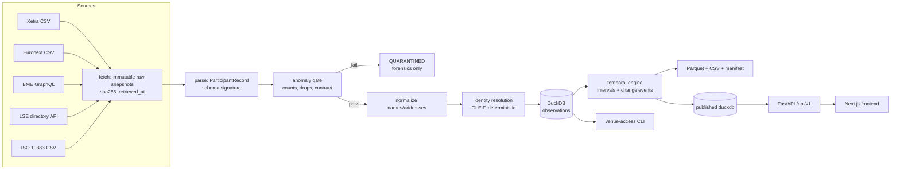
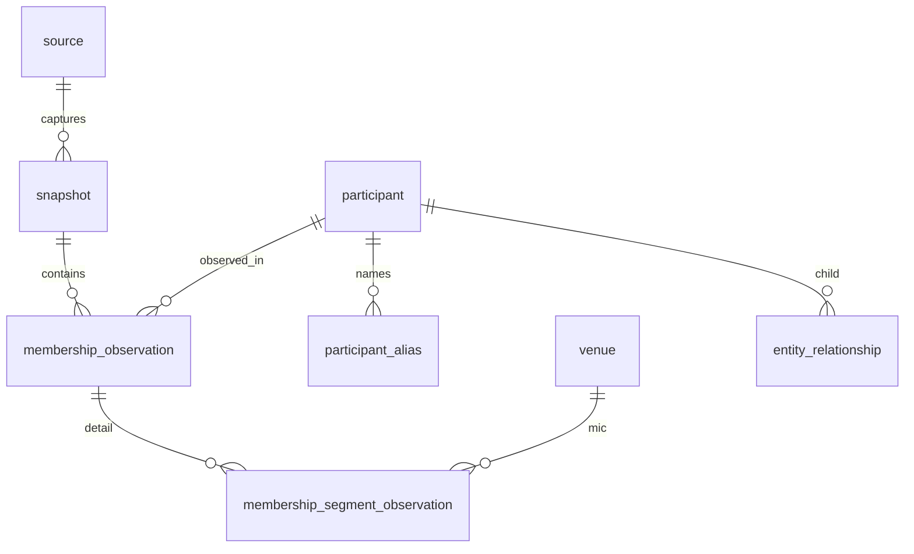

# Architecture

## Data model

- `snapshot` — immutable capture metadata (raw_sha256, parser_version, status)
- `participant` — resolved entity keyed `lei:{LEI}` or `unresolved:{src}:{key}`
- `participant_alias` — every raw name/address per source, preserved verbatim
- `membership_observation` — presence of a participant in a snapshot
- `membership_segment_observation` — per-market/family/member-code detail
- `membership_interval` + `change_event` — derived, recomputed deterministically
- `venue` — ISO 10383 dimension (operating/segment MIC hierarchy)
- `entity_relationship` — GLEIF Level-2 relationships only (authoritative)
- `identity_resolution` — full audit trail incl. rejected candidates
- `gleif_entity` — cached GLEIF evidence for resolved LEIs
